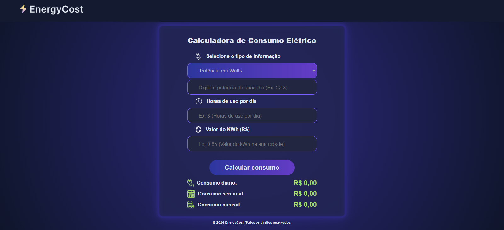

# ⚡ Energy Cost Calculator

Aplicação web desenvolvida para calcular o consumo de energia elétrica (kWh) e o custo estimado com base no uso diário de eletrodomésticos.

Este projeto foi criado com foco em **aprendizado prático**, **responsividade** e **boas práticas de Front-end**, simulando um problema real do dia a dia.

---

## 🔗 Demonstração

👉 Acesse o projeto online:  
https://vanderson14moraes.github.io/Conversor-de-Energia-Energy-Cost-/

---

## 🖥️ Preview

### Desktop

### Mobile

---

## 🚀 Funcionalidades

- Seleção de eletrodomésticos
- Cálculo de consumo em kWh
- Cálculo de custo diário, mensal e anual
- Interface responsiva (desktop e mobile)
- Layout moderno e intuitivo
- Validações básicas de entrada

---

## 🛠️ Tecnologias Utilizadas

- HTML5  
- CSS3 (Flexbox, Media Queries, Design Responsivo)  
- JavaScript (DOM, lógica de cálculo)  
- Git & GitHub  

---

## 📱 Responsividade

O layout foi desenvolvido com foco em **mobile-first**, testado em diferentes tamanhos de tela, incluindo iPhone e outros dispositivos móveis, com ajustes específicos para evitar quebras e overflow.

---

## 📚 Aprendizados

Durante o desenvolvimento deste projeto, pratiquei e aprendi:

- Estruturação semântica de HTML
- Organização e escalabilidade de CSS
- Responsividade real (não baseada em um único aparelho)
- Lógica de programação em JavaScript
- Debug e correção de problemas reais em produção
- Versionamento com Git e GitHub

---

